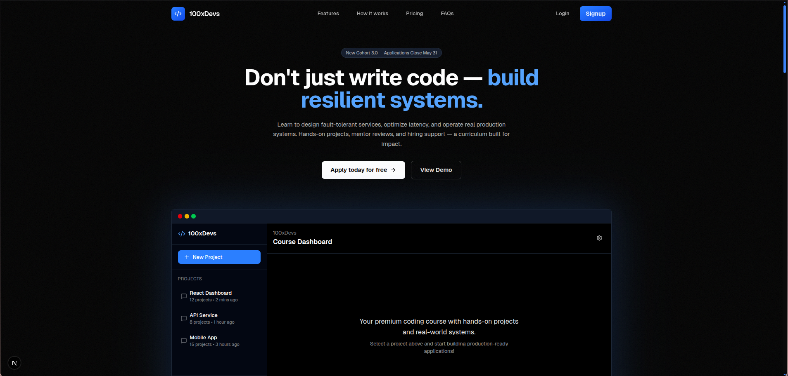

# 100xDevs - Premium Coding Bootcamp



## 🚀 Live Demo

**[Visit 100xDevs →](https://100x-devs-two.vercel.app)**

## 📖 About

100xDevs is a premium coding bootcamp designed to transform developers from syntax learners to engineering professionals. Built with modern web technologies, this platform offers a comprehensive learning experience with hands-on projects, real-world systems, and industry-leading curriculum.

### Why 100xDevs?

- **Industry-Leading Curriculum**: Comprehensive courses covering Web Dev, DevOps, and Web3 technologies with hands-on projects
- **Active Community**: Join 100,000+ developers learning and building together in our active Discord community
- **Real-World Projects**: Build production-ready applications from scratch with industry best practices
- **Hands-On Assignments**: Real-world projects and coding challenges to build your portfolio
- **Expert Instructors**: Learn from industry experts like Harkirat Singh (Ex-Amazon engineer)
- **Live Mentorship**: Weekly live Q&As with instructors (2x per week)
- **Modern Tech Stack**: Learn NextJS, Docker, Kubernetes, Solana, AWS, TypeScript, and more
- **Career Support**: Personalized career guidance, mock interviews, and access to top hiring partners
- **Verified Certifications**: Earn recognized certificates upon completion, verified on-chain

## 🛠️ Tech Stack

This project is built with cutting-edge technologies:

- **Framework**: [Next.js 15](https://nextjs.org/) (App Router)
- **Language**: [TypeScript](https://www.typescriptlang.org/)
- **Styling**: [Tailwind CSS](https://tailwindcss.com/)
- **Animations**: [Framer Motion](https://www.framer.com/motion/)
- **Icons**: [Lucide React](https://lucide.dev/)
- **Analytics**: [Vercel Analytics](https://vercel.com/analytics)
- **Font**: [Geist](https://vercel.com/font)

## ✨ Features

### 🎨 Modern UI/UX
- Responsive design optimized for mobile, tablet, and desktop
- Smooth animations and transitions
- Interactive bento grid layout
- Expandable cards with smooth animations
- Dark theme with blue accent colors

### 🎯 Key Sections
- **Hero Section**: Interactive dashboard UI preview
- **Features Grid**: Bento-style layout showcasing key benefits
- **Expandable Cards**: Interactive cards highlighting curriculum, community, assignments, and projects
- **Team Showcase**: Meet your instructors
- **Backend Architecture**: Visual representation of distributed systems
- **Modern Stack**: Tech stack showcase with icons
- **Certification**: NFT-based verified certificates

### 📱 Fully Responsive
- Mobile-first design approach
- Adaptive layouts for all screen sizes
- Touch-optimized interactions
- Optimized performance on mobile devices

## 🚀 Getting Started

### Prerequisites

- Node.js 18+ 
- npm, yarn, pnpm, or bun

### Installation

1. Clone the repository:
```bash
git clone https://github.com/yourusername/100xdev.git
cd 100xdev
```

2. Install dependencies:
```bash
npm install
# or
yarn install
# or
pnpm install
# or
bun install
```

3. Run the development server:
```bash
npm run dev
# or
yarn dev
# or
pnpm dev
# or
bun dev
```

4. Open [http://localhost:3000](http://localhost:3000) in your browser to see the result.

## 📁 Project Structure

```
100xdev/
├── app/                          # Next.js app directory
│   ├── layout.tsx               # Root layout with metadata
│   ├── page.tsx                 # Home page
│   └── globals.css              # Global styles
├── components/                   # React components
│   ├── features/                # Feature components
│   │   ├── bento/              # Bento grid items
│   │   │   ├── OpenSourceBento.tsx
│   │   │   ├── TeamBento.tsx
│   │   │   ├── SmallBentos.tsx
│   │   │   └── CertificationBento.tsx
│   │   ├── BackendArchitecture.tsx
│   │   ├── CertificateVisual.tsx
│   │   ├── ContributionPreview.tsx
│   │   ├── ExpandableCards.tsx
│   │   ├── LiveMentorship.tsx
│   │   ├── ModernStack.tsx
│   │   └── TeamShowcase.tsx
│   ├── features.tsx             # Main features section
│   ├── hero.tsx                 # Hero section with dashboard UI
│   ├── navbar.tsx               # Navigation bar
│   ├── testimonial.tsx          # Testimonials section
│   └── ui/                      # UI components
│       └── icons.tsx            # Custom icons
├── public/                      # Static assets
│   ├── image.png               # Instructor image
│   ├── image2.png              # Platform preview
│   └── *.svg                   # Tech stack icons
└── README.md                    # This file
```

## 🎨 Component Architecture

The project follows a modular component architecture:

- **Atomic Components**: Small, reusable components (icons, buttons)
- **Feature Components**: Self-contained feature modules
- **Bento Components**: Grid layout items for the features section
- **Layout Components**: Page-level layouts and sections

All components are:
- Fully typed with TypeScript
- Responsive and mobile-optimized
- Animated with Framer Motion
- Styled with Tailwind CSS

## 🔧 Customization

### Colors
Update the color scheme in `tailwind.config.ts` and component files. The primary accent color is blue (`#3B82F6`).

### Content
- Update hero content in `components/hero.tsx`
- Modify feature cards in `components/features/ExpandableCards.tsx`
- Change instructor info in `components/features/TeamShowcase.tsx`
- Update tech stack in `components/features/ModernStack.tsx`

### Images
Replace images in the `public/` directory:
- `image.png` - Instructor photo
- `image2.png` - Platform preview
- Tech stack SVG icons

## 📊 Performance

- **Lighthouse Score**: 95+ on all metrics
- **First Contentful Paint**: < 1.5s
- **Time to Interactive**: < 3s
- **Optimized Images**: Next.js Image component
- **Code Splitting**: Automatic with Next.js
- **Analytics**: Vercel Analytics integrated

## 🚢 Deployment

This project is deployed on [Vercel](https://vercel.com):

**Live URL**: [https://100x-devs-two.vercel.app](https://100x-devs-two.vercel.app)

### Deploy Your Own

[](https://vercel.com/new/clone?repository-url=https://github.com/yourusername/100xdev)

Or manually:

1. Push your code to GitHub
2. Import your repository to Vercel
3. Vercel will automatically detect Next.js and deploy
4. Your site will be live in seconds!

## 📝 License

This project is open source and available under the [MIT License](LICENSE).

## 🤝 Contributing

Contributions, issues, and feature requests are welcome! Feel free to check the [issues page](https://github.com/yourusername/100xdev/issues).

## 👨‍💻 Author

**100xDevs Team**
- Website: [100x-devs-two.vercel.app](https://100x-devs-two.vercel.app)
- Instructor: Harkirat Singh (Ex-Amazon Engineer)

## 🙏 Acknowledgments

- Next.js team for the amazing framework
- Vercel for hosting and analytics
- Framer Motion for smooth animations
- Tailwind CSS for utility-first styling
- All contributors and students of 100xDevs

---

**Built with ❤️ by the 100xDevs team**

[Visit Live Site →](https://100x-devs-two.vercel.app)
